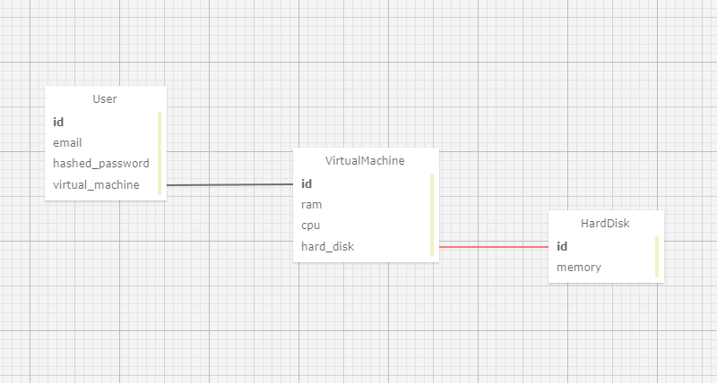

# Тестовое задание на сокетах

Клиент-серверное приложение на соккетах (asyncio) для учета клиентских машин .

## Как установить
- Склонируйте репозиторий:
```bash
git clone git@github.com:MaxHC-vlop/red_soft.git
```

- Для запуска необходим [poetry](https://python-poetry.org/docs/).

- Установите зависимости с помощью `poetry`:
```bash
poetry install
```

## Как запустить
- Перейдите в директорию с проектом:
```bash
cd socket_app
```

- Создайте БД с помощью миграций [alembic](https://alembic.sqlalchemy.org/en/latest/):
```bash
poetry run alembic upgrade head
```

- Заполните БД тестовыми данными:
```bash
poetry run python fill_db.py
```

- В БД создастся юзер со следующими данными:
```yaml
email: test1@test.com
password: 111
```

- Откройте 2 окна терминала и запустите клиента и сервер:
```bash
# терминал 1
poetry run python server.py

# терминал 2
poetry run python client.py
```

## Как пользоваться

- Демонстрация работы приложения на [видео](./content/тестовое.mp4).

- Сервер поддерживает 6 методов для работы с ним:
```yaml
1: Создание ВМ для текущего юзера
2: Список всех доступных ВМ
3: Обновление почты и пароля для аунтифекации текущего пользователя
4: Список всех доступных жестких дисков
5: Удаление ВМ по ее ID
6: Статистика по всем ВМ и жестким дискам
0: Выход с сервера, со стороны клиента
```

- При работе с сервером если клиент вводит `0`, он выходит с сервера .

## Схема БД

```yaml
User: один ко многим
VirtualMachine: один ко многим
```

